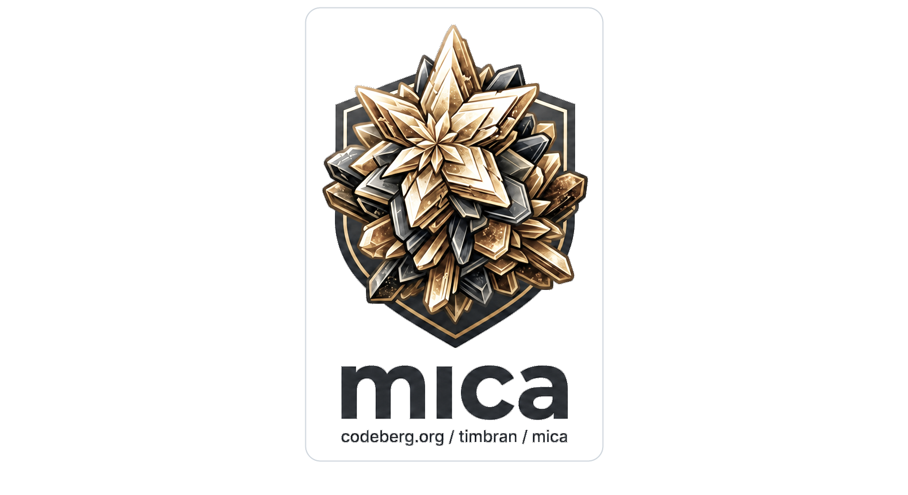

# Mica

<p align="center">
  
</p>

Mica is a live, programmable system for worlds of people, objects, places,
rules, knowledge, and behaviour that change over time.

The broader goal is a general-purpose language and runtime for domains whose
shape evolves over time: collaborative worlds, simulations, knowledge bases,
authoring systems, agent workspaces, games, operational models, and other
systems where the program and the data are both part of a live environment.

It grows out of lessons from [mooR](https://codeberg.org/timbran/moor), my
modern rewrite of LambdaMOO: a compatibility-focused MOO server with modern
conveniences, transactional infrastructure, and a much more serious runtime and
database substrate. Through that lineage, it inherits the model of image-based
authoring, multiuser worlds, long-lived shared state, and online extension.

Mica also draws from Datalog-style rules, Self-style prototype delegation,
multimethod dispatch, and tuple-space-like ideas about shared facts that
independent processes can read, write, and react to.

Mica is less of a nostalgia project than mooR. It has no backwards
compatibility constraint, so it can be a cleaner canvas for new ideas about
objects, relations, rules, dispatch, agents, and live programmable systems.

> The name also reaches back to an earlier abandoned project I worked on between
2001 and 2004: an incomplete prototype-oriented, image-based object system in
the same broad family of ideas as MOO, ColdMUD, and similar systems. That
earlier Mica was written in C++, and the last version of its sources appears to
be lost to time. This project is not a continuation of that code, but it is a
return to some of the same questions with different tools and a more relational
foundation.

>**NOTE**: If you're looking at this on GitHub be aware this is just a mirror from 
the canonical Codeberg repository at https://codeberg.org/timbran/mica

## Core Idea

Mica is based around the concept of persistent / long-lived objects that
multiple authors can extend in a live environment over time.

But Mica treats an object as a durable identity described by facts, not as a
single container that owns all of its fields and methods:

```mica
Object(#lamp)
Name(#lamp, "brass lamp")
LocatedIn(#lamp, #room)
Delegates(#lamp, #thing, 0)
Portable(#lamp)
```

`#lamp` is not a record. It is a durable identity value that appears in facts.
The "object" is the fact neighbourhood around that identity: the facts, derived
facts, rules, methods, permissions, and history that mention it.

Many object systems build a few relationships directly into the runtime:
parent/child, location/contents, ownership, visibility, or method lookup. Mica
tries to make those relationships authorable. They can be ordinary relations,
rules, constraints, and behaviours that the world can inspect and extend.

That means object structure is not fixed by one privileged storage layout. A
world can add new relations when it needs new concepts:

```mica
AcousticNeighbour(#hall, #atrium, 2)
OwnedAt(#lamp, #alice, t1)
WeatherExposed(#garden)
Believes(#agent7, #door, :locked)
```

Relations can be indexed, constrained, queried, derived, and authorised.

## Behaviour

Behaviour is also relational. Instead of finding a method by starting from one
special receiver object, Mica dispatches over named roles:

```mica
verb get(actor: #player, item: #thing)
  if Portable(item)
    assert HeldBy(actor, item)
    return true
  else
    return false
  end
end
```

An invocation supplies role bindings:

```mica
:get(actor: #alice, item: #coin)
```

The dispatch engine finds methods whose role restrictions match the invocation.

This is a bit like prototype delegation, but it is actually part of matching:

```mica
Delegates(#coin, #thing, 0)
Delegates(#alice, #player, 0)
```

This is closer to multimethod dispatch than receiver-owned method lookup, but
keeps the live authoring feel of object systems and opens up more extensibility.

## Rules

Mica also has powerful Datalog-inspired derived relations:

```mica
CanSee(actor, item) :-
  HeldBy(actor, item)

CanSee(actor, item) :-
  HeldBy(actor, container),
  In(item, container)
```

Rules are installed into the live world and become part of ordinary relation
reads. They are meant to make world logic inspectable and authorable instead of
burying it in server internals.

Rules can also express positive recursive relationships, such as transitive
reachability:

```mica
Reachable(from, to) :-
  Exit(from, to)

Reachable(from, to) :-
  Exit(from, mid),
  Reachable(mid, to)
```

This lets authors define concepts like ancestry, containment, visibility,
dependency, graph reachability, or delegation closure in the same relational
language as the rest of the world. Negation is more restricted: Mica supports
stratified negation, not arbitrary recursion through `not`.

## Language Shape

Mica's surface language is intended to feel familiar to people who know MOO or
mooR, while borrowing from Dylan, Julia, Datalog, and Algol-family languages.

Current syntax includes:

```mica
make_identity(:alice)
make_identity(:coin)
make_relation(:HeldBy, 2)

assert HeldBy(#alice, #coin)

for key, value in properties
  render_property(key, value)
end
```

The language is expression-oriented: control forms, assignments, assertions,
queries, and calls produce values.

## Isn't this just a Database?

Mica uses database ideas, but it is not trying to be SQL with a different skin.

The runtime needs:

- stable identities as first-class values;
- live mutation of relations, methods, and rules;
- transactional command execution;
- role-based dispatch;
- prototype delegation;
- derived relations;
- object-neighbourhood inspection;
- author-facing syntax;
- durable relation state and restart recovery.

Those concerns overlap with databases, object systems, logic languages, and
interactive programming environments, but none of those models alone is quite
the intended shape.

## For Agents and Tools

Mica is meant to be a good substrate for agents and other software that needs to
inspect, explain, and change a live domain model.

There are many systems now described as agentic memory, agent workspaces,
coordination layers, blackboards, or shared context stores. Mica belongs in
that conversation, but it is aiming at a stronger foundation than a bag of
messages, vector memories, task records, and tool calls. It treats the shared
state as a durable, transactional, queryable world model with identities,
relations, rules, behaviours, and authority as first-class parts of the system.

Agents work best when the world is not opaque. In Mica, the important concepts
are available as relations, rules, methods, and identities that can be queried
and edited with the same language authors use. An agent can ask what facts
mention an identity, why a derived relation is true, which behaviours can apply
to an invocation, or what authority is needed to make a change.

That makes Mica useful for systems where human and software authors collaborate:
knowledge bases, simulations, planning environments, design tools, operational
models, and long-lived shared workspaces.

## MOO-Like Worlds

Mica can be used to build [MOO-like](https://en.wikipedia.org/wiki/MOO)
systems: rooms, exits, containers, players, verbs, live authoring, and shared
programmable spaces.

MOO's core insight is still powerful: a running world can be its own authoring
environment. Mica keeps that immediacy while changing the foundation. Object
state is facts, inheritance is delegation over identities, verbs dispatch over
roles, and policies like visibility or containment can be relations and rules
instead of privileged server internals.

MUD-like examples are useful because rooms, exits, containers, and inventory are
easy to understand. They are examples of the model, not the boundary of the
project.

## Current Status

Mica is an early Rust prototype. The current tree has:

- a compact value layer;
- a relation kernel with base facts, transactions, indexes, catalogue metadata,
  and derived rules;
- a virtual machine (register-based) runtime;
- a task manager that manages transaction and execution lifecycle;
- compiler for a growing Mica language surface;
- a compio-driven task driver for timed wakeups, input resumes, and emissions;
- role-based method dispatch;
- a "filein" syntax for bringing in state-as-initial-blueprint;
- Fjall-backed durable relation state with strict and relaxed commit modes;
- a simple runner and REPL;
- a small filein example.

Run the example:

```sh
cargo run --bin mica -- filein examples/mud-core.mica
```

Start the REPL:

```sh
cargo run --bin mica
```

Run the test suite:

```sh
cargo test --workspace
```

## Repository Map

- [`crates/var`](crates/var/README.md): Mica value representation.
- [`crates/relation-kernel`](crates/relation-kernel/README.md): relation
  storage, transactions, rules, dispatch matching, and catalogue facts.
- [`crates/runtime`](crates/runtime/README.md): register VM, task manager, tasks,
  builtins, and effects.
- [`crates/compiler`](crates/compiler/README.md): lexer, parser, lowering,
  semantic analysis, and bytecode compilation.
- [`crates/runner`](crates/runner/README.md): REPL, filein runner, builtins,
  and rendered reports.
- [`crates/driver`](crates/driver/README.md): compio task driver, wakeups,
  input, and emissions.
- `examples/mud-core.mica`: small ontology proving relations, rules, filein,
  verbs, and dispatch.
- `sketches/MICA_*.md`: design notes for syntax, semantics, standard library,
  and the relation kernel.
- [`CODING-STYLE.md`](CODING-STYLE.md): project coding guidelines, including dependency policy.
- [`CONTRIBUTING.md`](CONTRIBUTING.md): contribution expectations, checks, and licence terms.

## Licence

Mica is free software licensed under the GNU Affero General Public License v3.0,
as set out in [LICENSE](LICENSE).

## Direction

Near-term work is about making the live system cohere:

- method and verb source cataloguing;
- fileout for identities, relations, rules, methods, and facts;
- richer ontology examples beyond the current MUD-shaped smoke test;
- object neighbourhood/outliner queries;
- authority and capability design;
- durable storage hardening, compaction, and recovery testing;
- more complete rule evaluation and query planning;
- a clearer standard library for common relations.

The long-term aim is a practical live relational object system: immediate
enough for authors, rigorous enough for durable multiuser systems, and explicit
enough for tools and agents to inspect, explain, and extend.
