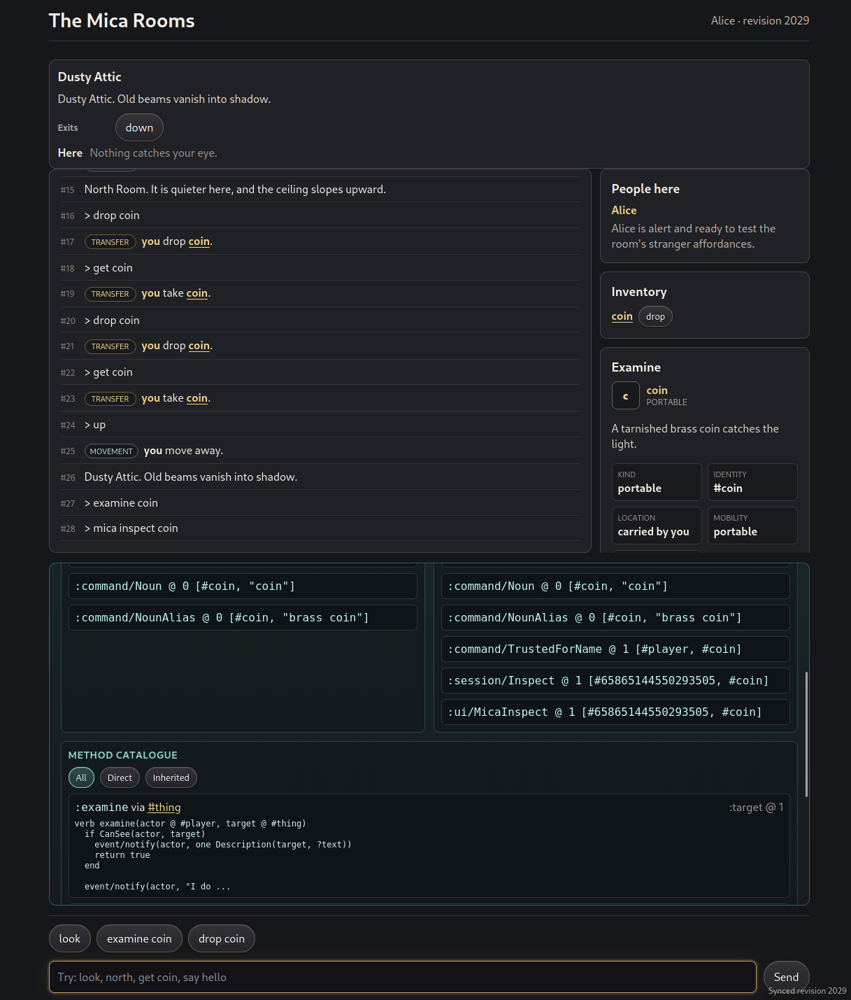

# Mica

[](https://github.com/sponsors/rdaum)

<p align="center">
  
</p>

<p align="center">
  Is it a database? A programming language? A runtime?<br>
  <strong>Yes.</strong>
</p>

Mica is a programming language and runtime for building long-lived shared systems around facts,
rules, objects, and inference.

It is for software whose state is not only stored but reasoned over: live worlds where facts can
imply other facts, rules define derived relations, and authors can extend the logic while the system
is running. Collaborative worlds, simulations, knowledge bases, agent workspaces, games, and
operational tools are all natural fits.

Under the hood, Mica brings together deductive world logic, durable data, and server-side execution
in one system. If you think in terms of today's typical stack, it sits across some of the space you
might otherwise fill with Node, Postgres, background jobs, and application glue, but as one coherent
system.

Mica is designed for backend developers, game and simulation builders, PL-curious engineers, and
agent/tooling authors who want shared state to be queryable, derivable, and editable while it runs.
If you have wished your database could hold your object model, your rules, and your live behaviour
in one transactional store, Mica is aimed at you.

## Try It

The quickest way to see Mica running is the browser MUD example:

```sh
scripts/mud.sh
```

The wrapper starts the daemon with the browser MUD fileins and prints the local `/mud` URL to open.

For a smaller entry point, run a simple filein through the CLI:

```sh
cargo run --bin mica -- filein apps/shared/capabilities.mica
```

Start the REPL:

```sh
cargo run --bin mica
```

Run the test suite:

```sh
cargo test --workspace
```

The rest of this document explains the model behind those commands.

## Identify

If you come from SQL, a Mica relation is roughly a table, and a fact is roughly a row; in relational
terms, that row is a tuple. An "identity" could be seen as a "primary key". In an OO language, the
"identity" is a bit like an object pointer. These are useful anchors, though a crude translation.

Mica represents objects as durable identity values described by relation facts:

```mica
Object(#lamp)
Name(#lamp, "brass lamp")
LocatedIn(#lamp, #room)
Delegates(#lamp, #thing, 0)
Portable(#lamp)
```

`#lamp` is a durable identity value. The "object" is the fact neighbourhood around that identity:
the facts, derived facts, rules, methods, and authority policy that mention it.

An object is still something authors can name, browse, extend, invoke behaviour on, and keep alive
across restarts. Its slots, parent links, methods, permissions, and derived state are represented as
relations around a durable identity rather than fields in one fixed record.

In the current app fileins, `#lamp` is an identity value, `:get(...)` invokes a verb, and relation
names such as `HeldBy`, `LocatedIn`, and `Name` name stored or derived facts.

Many object systems build a few relationships directly into the runtime: parent/child,
location/contents, ownership, visibility, or method lookup. Mica tries to make those relationships
authorable. They can be ordinary relations, rules, functional relation metadata, and behaviours that
the world can inspect and extend.

That means object structure is not fixed by one privileged storage layout. A world can add new
relations when it needs new concepts:

```mica
AcousticNeighbour(#hall, #atrium, 2)
OwnedAt(#lamp, #alice, t1)
WeatherExposed(#garden)
Believes(#agent7, #door, :locked)
```

Relations can be indexed, queried, derived, and checked through actor-derived authority. Functional
relations declare key positions, so assignments such as `#lamp.name = "brass lamp"` replace the one
matching tuple instead of adding a duplicate fact.

For object-system readers:

| Object-system idea              | Mica shape                                     |
| ------------------------------- | ---------------------------------------------- |
| object pointer or object number | durable identity value                         |
| slot or property                | relation fact mentioning the identity          |
| parent or prototype link        | `Delegates(child, parent, order)`              |
| method dictionary               | verb/method facts matched by role restrictions |
| inspector or browser            | object-neighbourhood query or outliner         |

For database readers: at the storage layer, Mica relations are arity-fixed sets of tuples over Mica
values. Base relations are mutated transactionally. Derived relations are defined by rules and read
through the same relation interface. Identities such as `#lamp` are values, not rows; relation
tuples are the durable facts that describe them.

## Behave

Behaviour is also relational. Instead of finding a method by starting from one special receiver
object, Mica dispatches over named roles:

```mica
verb get(actor @ #player, item @ #thing)
  if Portable(item)
    assert HeldBy(actor, item)
    return true
  else
    return false
  end
end
```

An invocation supplies role bindings:

```mica
:get(actor: #alice, item: #coin)
```

The dispatch engine finds methods whose role restrictions match the invocation. The restriction
`item @ #thing` says that the `item` role must be an identity that matches `#thing`, either directly
or through delegation. Methods are not looked up inside a receiver's private method dictionary; they
are installed into the live world and selected by matching the roles in the invocation.

Delegation participates in dispatch matching:

```mica
Delegates(#coin, #thing, 0)
Delegates(#alice, #player, 0)
```

The third argument is the delegation order. It lets an identity have multiple delegates while
keeping dispatch and inherited relation lookup deterministic where order matters.

Role dispatch gives Mica multimethod-like selection while still allowing verbs to be installed and
edited in the running world.

## Rules

Mica also has Datalog-inspired derived relations:

```mica
CanSee(actor, item) :-
  HeldBy(actor, item)

CanSee(actor, item) :-
  HeldBy(actor, container),
  In(item, container)
```

Rules are installed into the live world and become part of ordinary relation reads. They are meant
to make world logic inspectable and authorable instead of burying it in server internals.

Rules can also express positive recursive relationships, such as transitive reachability:

```mica
Reachable(from, to) :-
  Exit(from, to)

Reachable(from, to) :-
  Exit(from, mid),
  Reachable(mid, to)
```

This lets authors define concepts like ancestry, containment, visibility, dependency, graph
reachability, or delegation closure in the same relational language as the rest of the world.
Negation is more restricted: Mica supports stratified negation, not arbitrary recursion through
`not`.

Rules in Mica stay live. Suppose a rule says that Alice can see every item inside a container she is
holding. Putting a coin into that container automatically makes `CanSee(#alice, #coin)` true. Taking
the coin out makes it false again. These rule-produced facts are called derived facts.

Application code does not have to find and update every conclusion affected by a change. Mica
follows the consequences through chains of rules, including relationships such as rooms reachable
through other rooms, and finishes the whole update before anyone can observe it. Other tasks see the
world either before or after the change, never halfway through.

Applications can also ask to be notified when a stored or derived fact becomes true or false. This
makes rule-driven views, simulations, agents, and user interfaces able to react as the shared world
changes.

## Express

Mica's surface language is intended to feel familiar and readable. It borrows from Julia, Dylan,
Datalog, and Algol-family languages. It will also feel broadly familiar to people who have been
exposed to MOO (and the dialect of it in my [mooR](https://codeberg.org/timbran/moor) project.)

Here's an example snippet which shows various bits of syntax to give you a sense of the flavour of
the language:

```mica
make_identity(:alice)
make_identity(:lamp)

// HeldBy has arity 2 (binary relation): each fact relates an owner and an item.
make_relation(:HeldBy, 2)

// Position 0 is the key, so each identity has one current Name value.
// Declared this way, Name can also be read and written as item.name.
make_functional_relation(:Name, 2, [0])

assert Name(#lamp, "brass lamp")
assert HeldBy(#alice, #lamp)

// Lambdas are ordinary values and can return closures.
let make_label = fn(prefix) => fn(name) => string_concat(prefix, name)

// Role restrictions dispatch on world identities, not only one receiver.
verb inspect(actor @ #identity, item @ #identity)
  // Dot syntax reads the functional Name relation declared above.
  let summary = {:actor -> actor, :item -> item, :name -> item.name}

  if HeldBy(actor, item)
    emit(actor, [:inspect, summary])
    return make_label("You are holding ")(item.name)
  end

  return make_label("You see ")(item.name)
end

// Queries bind variables such as ?owner and expose rows as maps.
for found in HeldBy(?owner, ?item)
  render_row(found[:owner], found[:item])
end
```

The language is expression-oriented: control forms, assignments, assertions, queries, and calls
produce values. Lexical scope and structure are defined through `begin .. end` type blocks, in the
Wirth-ish tradition.

## Persist

Mica uses transactional relation storage as part of its programming model. A Mica task runs against
a transaction snapshot and commits its relation changes as one unit. In database terms, the intended
baseline is snapshot isolation: roughly PostgreSQL `REPEATABLE READ`, not `SERIALIZABLE`.

That means object state, world rules, and author-visible facts can all live in the same durable
store instead of being split between a database, a source tree, and server internals. Persistence is
not an afterthought bolted onto the side of the runtime; it is part of how the system represents and
evolves a world over time.

Because the same relation store carries object state, dispatch metadata, world rules, and authority
policy, restart recovery brings back the live model itself, not only a pile of application data
waiting to be reinterpreted by server code.

## Author

You build a Mica world by creating persistent objects and teaching them new facts, rules, and verbs
(programs). The code that defines behaviour is part of the world: verbs live alongside the
identities they operate on, rather than in an external source tree.

Mica is designed for many human authors and software agents to extend a running world from inside
that world, with authority checks on reads, writes, invocations, and effects.

## Interact

Mica has affordances for serving content to web browsers, and ships with a light framework for
building interactive user interfaces that are automatically synchronized from server to browser
(similar to the [Phoenix framework's LiveView](https://www.phoenixframework.org/)).

The screenshot below is from `apps/mud/`, one example application built with Mica. It combines a
browser-rendered room/object world, command history, inventory, and live inspection of the facts and
methods in the same running world. The room view and inventory are relation reads; the inspect panes
show the facts and verbs around the identities you are looking at:

<p align="center">
  
</p>

## Recall

The same model that holds a world of rooms and objects also fits agent workspaces. Mica gives agents
and tools a queryable model of identities, relations, rules, verbs, and authority.

Compared with message logs or vector-memory stores, Mica keeps shared state in typed relations with
transactions, derived facts, executable behaviours, and authority checks. Message records,
embeddings, tool calls, and task rows can still exist, but they become facts about durable
identities.

```mica
Agent(#planner)
Task(#t42)
Goal(#t42, "prepare release notes")
AssignedTo(#t42, #planner)
Observation(#obs9)
ObservedBy(#obs9, #planner)
AboutTask(#obs9, #t42)
Mentions(#obs9, #crate_runtime)
ToolResult(#obs9, :git_diff, "...")

RelevantTo(agent, item) :-
  AssignedTo(task, agent),
  AboutTask(obs, task),
  Mentions(obs, item)
```

In this style, an agent workspace is not only a transcript. Tasks, observations, tool results,
claims, artefacts, and authority policy can be facts around durable identities. Rules can derive
working context such as relevance, readiness, visibility, ownership, or blocked-by relationships,
and behaviours can operate over those relations transactionally.

This can support:

- shared task and artefact state across humans and agents;
- blackboard-style coordination with transactional updates;
- provenance-aware observations and tool results;
- derived context views for each actor;
- policy-derived authority for actions and effects.

Agent integrations can query the same relations, rules, methods, and identities that authors edit.
Explanation APIs for derived facts, applicable behaviours, and authority failures are planned
tooling work.

That makes Mica useful for systems where human and software authors collaborate: knowledge bases,
simulations, planning environments, design tools, operational models, and long-lived shared
workspaces.

Vector indexes, embedding stores, and external tools can be attached as providers or tool-facing
facts. Mica's core model is the identity / relation / rule layer that says what those memories are
about and how they may be used.

## Background

Mica grows out of lessons from [mooR](https://codeberg.org/timbran/moor), my modern rewrite of
LambdaMOO: a compatibility-focused MOO server with modern conveniences, transactional command
execution, durable storage, and a modern Rust runtime. Through that lineage, it inherits the model
of image-based authoring, multiuser worlds, long-lived shared state, and online extension.

Mica also draws from Datalog-style rules, Self-style prototype delegation, multimethod dispatch, and
tuple-space-like ideas about shared facts that independent processes can read, write, and react to.

Mica is less of a nostalgia project than mooR. Without compatibility constraints, it can use
relations, rules, dispatch, and authority as the primary object model.

The name also reaches back to an earlier abandoned project I worked on between 2001 and 2004: an
incomplete prototype-oriented, image-based object system in the same broad family of ideas as MOO,
ColdMUD, and similar systems. That earlier Mica was written in C++, and the last version of its
sources appears to be lost to time. This project is not a continuation of that code, but it is a
return to some of the same questions with different tools and a more relational foundation.

## Current Status

Mica is pre-1.0 but is already a working system. The current tree can run live applications with
durable objects and facts, transactional relation updates, derived rules, role-based dispatch,
authority checks, and host surfaces for browsers, and daemon RPC.

Mica is designed to scale to large worlds. It has a Cranelift JIT, and on supported hardware a
`wgpu` GPU backend accelerates query execution, most beneficial on unified-memory systems (NVIDIA
GB10, AMD Strix Halo). Metal on Apple Silicon is a planned future target. With this, benchmarks show
dramatic speedups for suitable queries over larger data sets; ordinary CPU execution remains
available where acceleration is unavailable or inappropriate.

The most coherent example today is the browser MUD in `apps/mud/`, launched with `scripts/mud.sh`.
It shows the current shape of Mica better than a subsystem checklist does: a running world whose
facts, rules, verbs, browser UI, and live inspection views are all authored inside the same system.

## Getting Started

For the older telnet-oriented surface, load the MUD fileins explicitly:

```sh
cargo run --bin mica-daemon -- \
  --filein apps/shared/string.mica \
  --filein apps/shared/events.mica \
  --filein apps/mud/core.mica \
  --filein apps/mud/event-substitutions.mica \
  --filein apps/mud/command-parser.mica \
  --telnet-bind 127.0.0.1:7777
```

HTTP requests run as the `#web` principal by default. The daemon derives request-handler authority
from Mica policy facts rather than running `:http_request(...)` as root.

## Reference

The checked-in mdBook source lives under [`mdbook/src`](mdbook/src/SUMMARY.md). It is an in-progress
language and runtime reference; the generated HTML output is not committed yet.

## Repository Map

- [`crates/var`](crates/var/README.md): Mica value representation.
- [`crates/relation-kernel`](crates/relation-kernel/README.md): relation storage, transactions,
  rules, dispatch matching, and catalogue facts.
- [`crates/relation-wgpu`](crates/relation-wgpu): wgpu query acceleration for supported hardware.
- [`crates/source-provider`](crates/source-provider/README.md): source code browsing and VCS history
  exposed as Mica computed relations.
- [`crates/browser`](crates/browser/README.md): browser-oriented compiler, VM, and projected
  relation package.
- [`crates/vm`](crates/vm/README.md): bytecode format and register VM execution core.
- [`crates/compiler`](crates/compiler/README.md): lexer, parser, lowering, semantic analysis, and
  bytecode compilation.
- [`crates/runtime`](crates/runtime/README.md): live environment, task manager, builtins,
  filein/fileout, and rendered reports.
- [`crates/auth`](crates/auth/README.md): authentication and session management with PASETO tokens,
  OAuth (GitHub), and local password auth.
- [`crates/driver`](crates/driver/README.md): compio task driver, wakeups, input, and emissions.
- [`crates/runner`](crates/runner/README.md): CLI and REPL binary.
- [`crates/micac`](crates/micac/README.md): filein compiler CLI for compiling Mica source into a
  fresh database or check-only validation.
- [`crates/daemon`](crates/daemon/README.md): runtime daemon that wires Mica to telnet, HTTP,
  WebTransport, and host RPC surfaces.
- [`crates/host-protocol`](crates/host-protocol/README.md): shared protocol types for host effects,
  browser DOM sync, and endpoint interactions.
- [`crates/host-zmq`](crates/host-zmq/README.md): ZeroMQ transport for the host protocol.
- [`crates/host-console`](crates/host-console/README.md): interactive console for testing the host
  protocol over ZeroMQ.
- [`crates/web-host`](crates/web-host/README.md): minimal compio HTTP/1.1 host, request routing, and
  server-driven browser sync over HTTP/SSE.
- [`crates/webtransport-host`](crates/webtransport-host/README.md): compio QUIC and WebTransport
  host for browser sync sessions over datagrams and streams.
- [`crates/telnet-host`](crates/telnet-host/README.md): telnet listener, telnet codec, and host-side
  endpoint session handling.
- [`crates/testing`](crates/testing): load tools, harnesses, and test support crates.
- [`apps/shared`](apps/shared): shared Mica fileins for capabilities, strings, events, and browser
  DOM sync helpers.
- [`apps/web`](apps/web): core web-serving fileins such as HTTP dispatch and relational routing.
- [`apps/chat`](apps/chat): minimal browser chat example using the sync layer.
- [`apps/mud`](apps/mud/README.md): browser and telnet MUD example, including world model, command
  parsing, UI composition, and sync-driven views.
- [`apps/agent`](apps/agent/README.md): relation-first LLM coding agent shell reusing the MUD's sync
  patterns for transcript, workspace, and inspector.
- [`apps/source`](apps/source): fixtures for the source-provider computed relations.
- `sketches/MICA_*.md`: design notes for syntax, semantics, standard library, and the relation
  kernel.
- [`CODING-STYLE.md`](CODING-STYLE.md): project coding guidelines, including dependency policy.
- [`CONTRIBUTING.md`](CONTRIBUTING.md): contribution expectations, checks, and licence terms.

## Contributing

Contributions are welcome.

Please read [`CONTRIBUTING.md`](CONTRIBUTING.md) and [`CODING-STYLE.md`](CODING-STYLE.md) before
sending changes. Mica is still early, but it is a correctness-sensitive language and runtime
project, so the bar is intentionally high: changes should be understandable, tested, and grounded in
the current architecture.

File issues and send pull requests through the [GitHub repository](https://github.com/rdaum/mica).

## Support

If Mica is useful in your work, consider sponsoring development on
[GitHub Sponsors](https://github.com/sponsors/rdaum).

> [!NOTE] I am also available for consulting in systems engineering, language/runtime design, and
> Rust development. If this project is useful or interesting for your team, feel free to reach out.

## Licence

Mica is free software licensed under the GNU Affero General Public License v3.0, as set out in
[LICENSE](LICENSE).
